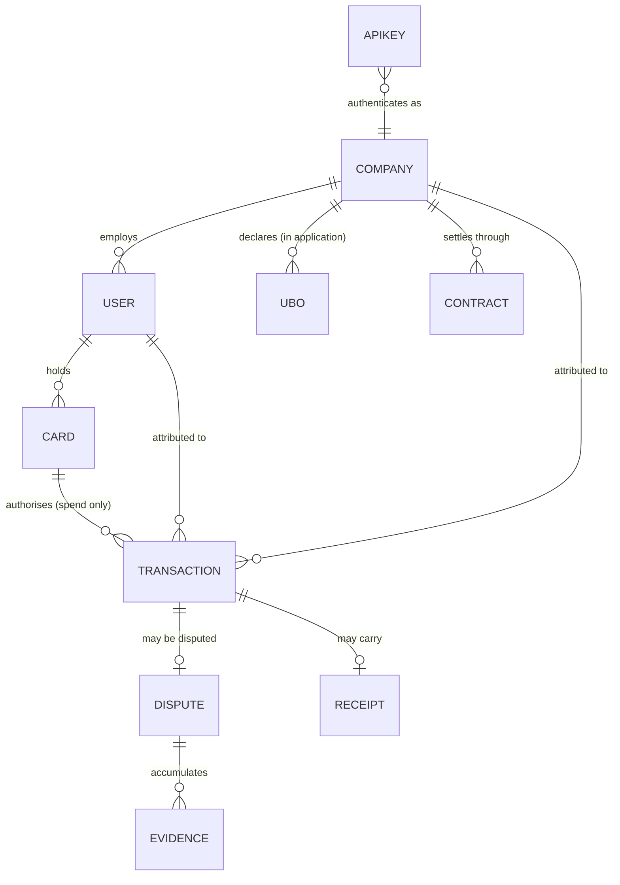
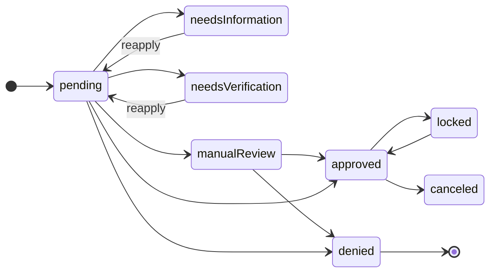

# Building a mock Rain

A guide for an agent asked to build a **mock Rain server** or a **mock Rain
client** for testing against `redrain`. Everything below is extracted from
`openapi/rain-issuing.json` (Issuing API v1.2.1) — that file is the source of
truth, and if this doc and the spec disagree, the spec wins.

Read `llm/outputs/port-methodology.md` first if you haven't; it explains why the
client behaves as it does.

---

## 1. Pick the right thing to build

Three options, cheapest first. **Do not build a server if a stub will do.**

| | What it is | Use when |
| --- | --- | --- |
| **WebMock stubs** | Per-test HTTP stubs, no shared state | Unit tests. This is what `redrain`'s own suite uses — 60 endpoints covered, zero infrastructure. |
| **Mock client** | An object quacking like `Redrain::Client`, in-process | Testing *your* code's use of Rain without touching HTTP. Fastest, but proves nothing about wire format. |
| **Mock server** | A real HTTP server holding state | End-to-end tests, demos, offline development, driving a UI. Only build this when you need Rain to *remember* things across requests. |

The distinction that matters: stubs and mock clients verify **your call sites**.
Only a mock server exercises `redrain` itself — auth headers, camelCase mapping,
retries, multipart encoding, cursor pagination.

### If you build a mock client

Make it fail loudly when reality diverges. A mock that silently accepts a method
`redrain` doesn't have is worse than no mock:

```ruby
class MockRainClient
  def initialize = @users = MockUsers.new
  attr_reader :users
end

# In a test-suite guard — catches drift the day `redrain` is regenerated.
Redrain::Resources::Users.instance_methods(false).each do |name|
  raise "MockUsers is missing ##{name}" unless MockUsers.method_defined?(name)
end
```

Better still, assert **arity and keywords** match, not just that the name exists.
`redrain`'s own `test/coverage_test.rb` does this against `resource_map.yml` and
is worth copying.

---

## 2. The data model

Six entities carry state. Everything else is a projection over them.



**All ids are UUIDs** (`format: uuid`). Generate real ones; don't use
`"user-1"`. `redrain` escapes path params per RFC 3986 and rejects `.`/`..`, so a
mock that hands out ids with slashes in them will surface as an `ArgumentError`
client-side, not a 404.

**All money is integer cents.** `creditLimit`, `amount`, `balanceDue` — every
one. The single exception is `CollateralTransaction.amount`, typed `number` in
the spec. Preserve that quirk; don't "fix" it.

### 2.1 Application vs. entity

The trap in this API: **a company/user exists in two forms**, and they share an
id.

- `/applications/company/{id}` — the KYB/KYC application. Carries
  `applicationStatus`, `applicationReason`, verification links.
- `/companies/{id}` — the live entity. Same id, no application fields on the
  create path, but `IssuingCompany` and `IssuingUser` **inherit from
  `IssuingApplication`**, so the application fields ride along on both.

A mock must return the same id from both routes. Creating via
`POST /applications/user` and then fetching `GET /users/{id}` with that id has to
work.

### 2.2 Field reference

Only fields the spec actually declares. `IssuingUser` and `IssuingCompany` both
inherit the four `IssuingApplication` fields.

**IssuingApplication** (mixed into user and company)

| Field | Type |
| --- | --- |
| `applicationStatus` | `ApplicationStatus` enum |
| `applicationExternalVerificationLink` | object |
| `applicationCompletionLink` | object |
| `applicationReason` | string — why the status is what it is |

**IssuingUser**: `id`, `companyId`, `firstName`, `lastName`, `email`,
`isActive` (bool), `isTermsOfServiceAccepted` (bool), `address`
(`PhysicalAddress`), `phoneCountryCode`, `phoneNumber` + application fields.

**IssuingCompany**: `id`, `name`, `address`, `ultimateBeneficialOwners` (array of
`IssuingApplicationPerson`) + application fields.

**IssuingApplicationPerson** (a UBO): `id`, `firstName`, `lastName`, `birthDate`
(date), `nationalId`, `countryOfIssue`, `email`, `phoneCountryCode`,
`phoneNumber`, `address`.

**PhysicalAddress**: `line1`, `line2`, `city`, `region`, `postalCode`,
`countryCode`, `country`.

**IssuingCard**: `id`, `companyId`, `userId`, `type` (`physical`|`virtual`),
`status` (`IssuingCardStatus`), `limit` (`IssuingCardLimit`), `last4`,
`expirationMonth`, `expirationYear`, `tokenWallets` (array of string).

**IssuingCardLimit**: `amount` (cents), `frequency` — one of
`per24HourPeriod`, `per7DayPeriod`, `per30DayPeriod`, `perYearPeriod`,
`allTime`, `perAuthorization`.

**IssuingDispute**: `id`, `transactionId`, `status`, `textEvidence`,
`createdAt`, `resolvedAt`.

**IssuingContract**: `id`, `chainId`, `controllerAddress`, `proxyAddress`,
`depositAddress`, `tokens` (array), `contractVersion`. This is crypto
collateral plumbing — a mock can return a fixed contract per company.

**IssuingKey**: `id`, `key`, `name`, `expiresAt`. `key` is the secret and is
returned **only** from `POST /keys`.

### 2.3 Transactions are a tagged union

`IssuingTransaction` is `oneOf` four variants discriminated by `type`. Every
variant is `{id, type, <payload>}` where the payload key equals the type.

| `type` | Payload key | Meaning |
| --- | --- | --- |
| `spend` | `spend` | Card authorisation at a merchant |
| `collateral` | `collateral` | Crypto collateral deposited on-chain |
| `payment` | `payment` | Repayment against the balance |
| `fee` | `fee` | Charge Rain (or you) levied |

Emit **only the matching payload key**. `redrain` merges the variants into one
class with predicates, so a mock that emits all four keys makes `spend?` and
`fee?` both true and the model meaningless.

```json
{ "id": "…", "type": "spend",
  "spend": { "amount": 4250, "currency": "USD", "merchantName": "Blue Bottle",
             "status": "completed", "cardId": "…", "userId": "…" } }
```

`spend` is by far the richest: `amount`, `currency`, `localAmount`,
`localCurrency`, `authorizedAmount`, `authorizationMethod`, `memo`, `receipt`
(bool), `merchantName`, `merchantCategory`, `merchantCategoryCode`,
`enrichedMerchantIcon`, `enrichedMerchantName`, `enrichedMerchantCategory`,
`cardId`, `cardType`, `companyId`, `userId`, `userFirstName`, `userLastName`,
`userEmail`, `status`, `declinedReason`, `authorizedAt`, `postedAt`.

`collateral` and `payment`: `amount`, `currency`, `memo`, `chainId`,
`walletAddress`, `transactionHash`, `companyId`, `userId`, `postedAt` (+ `status`
on payment). `fee`: `amount`, `description`, `companyId`, `userId`, `postedAt`.

> **Spec quirk to preserve:** `postedAt` is `date-time` on `collateral` and
> `fee`, but a bare `string` on `spend` and `payment`. `redrain` therefore
> returns a `Time` for two variants and a `String` for the other two. Don't
> normalise this in the mock — you'd hide a real inconsistency.

### 2.4 Signatures are also a union

`IssuingSignature` is `oneOf`, discriminated by `status`:

- **pending** → `{status: "pending", retryAfter: <int seconds>}`
- **ready** → `{status: "ready", signature: {data, salt}, expiresAt}`

A good mock returns `pending` on the first call and `ready` afterwards. That's
the only place in the API with an inherent poll loop, and code that assumes
`ready` immediately will break against real Rain.

---

## 3. State machines

Model these as real transitions. A mock that lets any status become any other
will let broken code pass.



**ApplicationStatus**: `approved`, `pending`, `needsInformation`,
`needsVerification`, `manualReview`, `denied`, `locked`, `canceled`. The spec
declares the values, not the transitions — the graph above is a reasonable
reading, not gospel. Confirm with Rain before treating it as contract.

**IssuingCardStatus**: `notActivated` → `active` ⇄ `locked` → `canceled`.
Cards are created `notActivated`. `canceled` is terminal.

**Dispute status**: `pending` → `inReview` → (`accepted` | `rejected`), or
`canceled` from any non-terminal state. Set `resolvedAt` when reaching a
terminal state — that's the field a client uses to tell "done" from "in flight".

**Spend transaction status**: `pending` → (`completed` | `reversed` |
`declined`). A `declined` spend should carry `declinedReason`.

**Key invariant:** only an `approved` user should get a working card, and only an
`active` card should authorise a spend. Enforcing this is most of a mock's value.

---

## 4. Endpoint behaviours a mock must get right

The full route table lives in `dev/resource_map.yml`. These are the ones with
behaviour beyond "return the object".

### 4.1 Status codes are not all 200

`redrain` returns `nil` for 204, so a mock returning `200 {}` where the spec says
204 will silently change the client's return value.

| Code | Endpoints |
| --- | --- |
| **201** | `POST /keys`, `POST /companies/{id}/charges`, `POST /users/{id}/charges` |
| **202** | all three payment initiations — *accepted, not settled* |
| **204** | 11 endpoints: every document/evidence/receipt upload, `PUT /cards/{id}/pin`, `PATCH /disputes/{id}`, `PATCH /transactions/{id}`, `DELETE /keys/{id}`, `DELETE /users/{id}` |

The 202s matter semantically: `POST /payments` returns `{address}` — a deposit
address, not a completed payment. The corresponding `payment` transaction should
appear *later*, initially `status: "pending"`.

### 4.2 Binary endpoints

Two return `application/octet-stream`:
`GET /disputes/{id}/evidence` and `GET /transactions/{id}/receipt`.

Serve real bytes with the right `Content-Type`. `redrain` returns the raw
`String` without JSON-parsing it. Returning JSON here will not fail loudly — it
will hand the caller a string of JSON, which is worse.

### 4.3 Multipart uploads

Six endpoints take `multipart/form-data`, all with one binary field plus string
fields. Rain caps uploads at **20 MB**.

| Endpoint | File field | Notable |
| --- | --- | --- |
| `PUT /applications/user/{id}/document` | `document` | `type` from the 19-value person list |
| `PUT /applications/company/{id}/document` | `document` | `type` from the 12-value company list |
| `PUT /applications/company/{id}/ubo/document` | `document` | identifies the UBO by **`email`**, not id |
| `PUT /applications/company/{id}/ubo/{uboId}/document` | `document` | same job, by id |
| `PUT /disputes/{id}/evidence` | `evidence` | `name` and `type` both required |
| `PUT /transactions/{id}/receipt` | `receipt` | |

Person document types: `idCard`, `passport`, `drivers`, `residencePermit`,
`utilityBill`, `selfie`, `videoSelfie`, `profileImage`, `idDocPhoto`,
`agreement`, `contract`, `driversTranslation`, `investorDoc`,
`vehicleRegistrationCertificate`, `incomeSource`, `paymentMethod`, `bankCard`,
`covidVaccinationForm`, `other`.

Company document types: `directorsRegistry`, `stateRegistry`, `incumbencyCert`,
`proofOfAddress`, `trustAgreement`, `informationStatement`, `incorporationCert`,
`incorporationArticles`, `shareholderRegistry`, `goodStandingCert`,
`powerOfAttorney`, `other`.

**Have the mock actually parse the multipart body** and assert the filename and
part `Content-Type` arrived. That's the one thing WebMock can't check, and it is
exactly where `redrain` had two real bugs (a retry uploading an empty file, and a
crash on non-ASCII filenames). A mock that ignores the body forgoes the main
reason to build one.

### 4.4 Cursor pagination

Five list endpoints paginate: `cards`, `companies`, `disputes`, `transactions`,
`users`. Semantics:

- `limit` — **min 1, max 100, default 20**. Clamp it; don't honour 500.
- `cursor` — "the id of the resource after which to start fetching".
- The response is a **bare JSON array**. No envelope, no `total`, no `nextCursor`.

Ordering must be **stable** — insertion order is fine, random is not.
`redrain`'s pager advances by taking the last record's `id` as the next cursor
and stops on a short page, so an unstable sort makes it loop or skip.

Available filters (all optional, AND-combined):

| Endpoint | Filters |
| --- | --- |
| `GET /cards` | `companyId`, `userId`, `status` |
| `GET /users` | `companyId` |
| `GET /companies` | — |
| `GET /disputes` | `companyId`, `userId`, `transactionId` |
| `GET /transactions` | `companyId`, `userId`, `cardId`, `type`, `transactionHash`, `authorizedBefore`, `authorizedAfter`, `postedBefore`, `postedAfter` |

The four transaction date filters take ISO 8601; `redrain` serialises `Time`
objects for you. Implement at least one so date filtering gets exercised.

### 4.5 Encrypted payloads

`GET /cards/{id}/secrets` → `{encryptedPan: {iv, data}, encryptedCvc: {iv, data}}`
`GET /cards/{id}/pin` → `{encryptedPin: {iv, data}}`
`PUT /cards/{id}/pin` takes the same `{encryptedPin: {iv, data}}` shape.

A mock should return **plausible base64 in the right shape** and need not
implement real crypto. Keep the envelope exact — the nesting is what client code
destructures. Never put a real PAN here, even in a mock; the shape says
"encrypted" and someone will eventually log it.

### 4.6 Balances

`GET /balances`, `/companies/{id}/balances`, `/users/{id}/balances` all return
the same five integer-cent fields: `creditLimit`, `pendingCharges`,
`postedCharges`, `balanceDue`, `spendingPower`.

Make them **derived, not fixed**. A mock where a spend doesn't move
`pendingCharges` and `spendingPower` won't catch the bugs worth catching:

```
pendingCharges  = Σ spend transactions with status "pending"
postedCharges   = Σ spend + fee transactions with status "completed"
balanceDue      = postedCharges − Σ completed payments
spendingPower   = creditLimit − pendingCharges − balanceDue
```

That's a plausible reading of the field names, not something Rain documents.
Verify against real Rain before relying on it for anything financial.

---

## 5. Auth and errors

**Auth is `Api-Key: <key>` — a plain header, not `Authorization: Bearer`.**
Reject a missing or unknown key with 401. `redrain` maps that to
`Redrain::AuthenticationError`.

**Error bodies have no schema.** The spec documents 400/401/403/404/500 as bare
descriptions with no content. `redrain` therefore treats the body as opaque and
exposes `#status`, `#body`, `#headers`, `#request_id`, and a best-effort
`#error_message` reading `message` or `error`.

So the mock is free to choose a shape — pick one and stay consistent:

```json
{ "message": "Card not found", "code": "card_not_found" }
```

**Emit an `X-Request-Id` header on every response**, especially errors.
`redrain` surfaces it as `#request_id`, and code that logs it should be
exercised.

**Give the mock a way to force failures.** Not for realism — so error paths get
tested at all. A header is the least intrusive lever:

```
X-Mock-Fail: 429           → rate limit, with Retry-After
X-Mock-Fail: 500           → server error
X-Mock-Latency-Ms: 3000    → slow response
```

Then assert the client's retry behaviour: **408, 409, 429 and 5xx are retried
twice** with jittered backoff honouring `Retry-After`; other 4xx are never
retried. A mock that counts requests per key can verify this directly — it's
one of the highest-value things a mock server can prove.

---

## 6. Implementation notes

**Storage.** Six hashes keyed by id, in memory. Nothing here needs a database.
Reset between tests; expose `POST /__reset` and `POST /__seed` (under an
obviously non-Rain prefix so it can never collide with a real route).

**Determinism.** Seed the RNG. A mock that returns different ids per run makes
failures irreproducible. Accept an explicit seed and log it.

**Serve camelCase.** The wire format is camelCase throughout — `firstName`,
`walletAddress`, `companyId`. `redrain` maps to snake_case on the Ruby side. A
mock emitting snake_case will produce models where every declared field is `nil`
and every value sits in the unknown-key passthrough — quiet, and confusing to
diagnose.

**Absent ≠ null.** `redrain`'s `Model#key?` distinguishes them. If Rain would
omit a field, omit it; don't send `"phoneNumber": null`.

**Point the client at it** — no code changes needed:

```ruby
Redrain::Client.new(api_key: "mock-key", base_url: "http://localhost:4010")
# or: RAIN_BASE_URL=http://localhost:4010
```

`base_url:` beats `RAIN_BASE_URL` beats `environment:`. Note that `environment:`
is still validated even when overridden, so pass a valid one or none.

### 6.1 Consider generating it

`redrain` already generates 3,165 lines of client from
`openapi/rain-issuing.json` via `dev/generate.rb`. A mock server is the same
problem with the arrows reversed, and the same spec drives both. Before
hand-writing 60 handlers, consider:

- **Prism** (`@stoplight/prism-cli`) — serves any OpenAPI document as a mock
  with example/dynamic responses, zero code. Good enough for shape-level testing
  and available in about a minute. It will **not** give you state, derived
  balances, or state-machine enforcement.
- **A generated skeleton** — extend `dev/generate.rb` to emit route handlers,
  then hand-write only the stateful ones (balances, transactions, signatures).
  Keeps the mock in lockstep with the spec through `rake sync_spec`.

Reach for a hand-written server only when you need the stateful behaviour.
Be explicit about which you chose and why.

---

## 7. Verifying the mock is honest

A mock that drifts from Rain is worse than none: it makes broken code look
correct. Three defences, in order of value:

1. **Validate your own responses against the spec.** Load
   `openapi/rain-issuing.json`, find the operation, assert the response body
   matches the schema. This catches the majority of drift for a few lines of
   work, and it's the single highest-value thing on this list.
2. **Run `redrain`'s integration suite against the mock.**
   `test/integration/` exists for exactly the shapes WebMock can't verify —
   multipart and octet-stream. Point it at the mock via `RAIN_BASE_URL`.
   Anything that passes against real Rain must pass against the mock.
3. **Record real responses.** If you have dev credentials, capture real bodies
   and replay them as fixtures. Redact aggressively — PANs, PINs, keys, national
   ids, addresses. **Never commit a captured response without reading it first.**

**Re-run all three after `rake sync_spec` reports a change.** Spec drift is
exactly when a mock silently stops telling the truth.

---

## 8. Pitfalls

- **Don't return all four transaction payload keys.** Only the one matching
  `type`. Otherwise every variant predicate is true at once.
- **Don't return `200 {}` where the spec says 204.** The client returns `nil`
  for 204 and a `Hash` for 200.
- **Don't invent an envelope for lists.** Bare arrays. No `data`, no `total`.
- **Don't return unstable list ordering.** The pager cursors on the last id.
- **Don't skip `companyId` on user-owned records.** Cards and transactions
  carry both `userId` and `companyId`; filters rely on it.
- **Don't let `limit=500` return 500 records.** Real Rain caps at 100, and
  `redrain` clamps — a mock that doesn't hides the difference.
- **Don't put real card numbers, PINs or personal data in fixtures**, even for a
  mock. The shapes are named `encrypted*` for a reason.
- **Don't let the mock leak into production config.** No default that points at
  a mock; `base_url:` should be set explicitly by the test harness only.
- **`applications.company.ubo.upload_document` takes `email:`**, while
  `applications.company.ubo.document.upload` takes a `uboId` path param. Two
  different endpoints doing the same job.

## 9. Where to look

| | |
| --- | --- |
| Route → Ruby method, all 60 | `dev/resource_map.yml` |
| Field names, enums, required-ness | `openapi/rain-issuing.json` |
| Generated request/response shapes | `lib/redrain/{models,resources}/` |
| Stub patterns, all 60 endpoints | `test/resources/*_test.rb` |
| Multipart / binary expectations | `test/upload_test.rb`, `test/http_client_test.rb` |
| Live-API tests to point at the mock | `test/integration/` |
| Why the client behaves as it does | `llm/outputs/port-methodology.md` |
